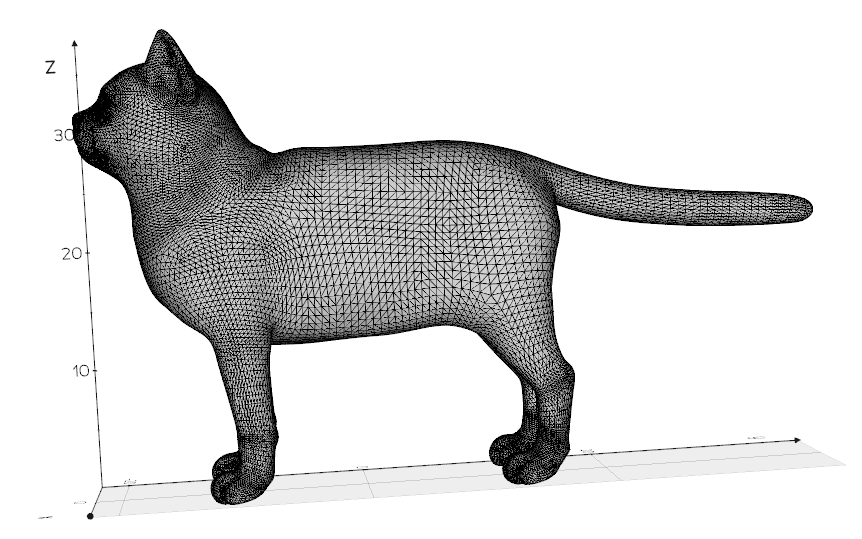

# Taller Construyendo Mundo 3D

## Nombre del estudiante

Alejandro Ortiz Cortes

## Fecha de entrega

15 de febrero de 2026

---

# Descripción breve

El objetivo de este taller fue comprender las estructuras gráficas fundamentales que componen los modelos 3D, conocidas como mallas poligonales. Estas mallas están formadas por tres elementos principales:

* **Vértices:** puntos en el espacio 3D que definen la forma del modelo.
* **Aristas:** líneas que conectan los vértices.
* **Caras:** superficies formadas por tres o más vértices (generalmente triángulos).

Durante el desarrollo del taller se trabajó con diferentes formatos de archivo estándar como `.OBJ`, `.STL` y `.GLTF`, y se utilizaron distintos entornos para cargar, visualizar y analizar estos modelos.

Se implementaron soluciones en:

* Three.js con React Three Fiber
* Python usando trimesh y vedo

Estas implementaciones permitieron visualizar el modelo, resaltar su estructura y analizar su composición.

---

# Implementaciones

## Implementación 1: Three.js con React Three Fiber

### Descripción

Se creó un proyecto utilizando Vite y React Three Fiber para cargar y visualizar modelos 3D en diferentes formatos (.OBJ, .STL y .GLTF).

El visor implementado permite:

* Cargar modelos 3D
* Rotar, mover y hacer zoom usando OrbitControls
* Visualizar el modelo en diferentes modos:

  * Caras (modo sólido)
  * Aristas (wireframe)
  * Vértices (points)

También se implementó una interfaz usando Leva que permite cambiar el modo de visualización y mostrar información estructural del modelo.

### Funcionalidades implementadas

* Carga de modelos usando:

```javascript
useGLTF()
useLoader(OBJLoader)
useLoader(STLLoader)
```

* Visualización interactiva:

```jsx
<OrbitControls />
```

* Visualización de aristas:

```jsx
<Edges />
```

* Visualización de vértices:

```jsx
<points>
```

* Visualización de estadísticas:

```javascript
Número de vértices
Número de aristas
Número de caras
```

---

## Implementación 2: Python con trimesh y vedo

### Descripción

Se utilizó Python con las librerías:

* trimesh
* vedo
* numpy
* tkinter

El programa permite seleccionar un archivo 3D y visualizar su estructura.

Se muestran:

* Vértices en color rojo
* Aristas en color negro
* Caras en color gris

También se calcula automáticamente la estructura de la malla.

### Información mostrada

El programa imprime:

```
Vértices: XXXXX
Aristas: XXXXX
Caras: XXXXX
```

### Funcionalidades adicionales

* Selección de archivo mediante ventana
* Visualización interactiva
* Generación de animación GIF del modelo rotando

---

# Resultados visuales

## Three.js

Vista de caras:


Vista de aristas:


Vista de vértices:


---

## Python

Visualización de malla:



Animación:


---

# Código relevante

## Three.js – Visualización de vértices

```jsx
<points geometry={geometry}>
  <pointsMaterial size={0.02} color="red" />
</points>
```

## Python – Cálculo de estructura

```python
vertices = mesh.vertices
edges = mesh.edges_unique
faces = mesh.faces

print("Vértices:", len(vertices))
print("Aristas:", len(edges))
print("Caras:", len(faces))
```

---

# Prompts utilizados

Se utilizó IA generativa como apoyo para:

* Comprender la estructura de mallas 3D
* Corregir el cálculo de vértices y aristas
* Implementar la visualización en React Three Fiber
* Implementar la visualización en Python usando trimesh y vedo

Ejemplos de prompts utilizados:

* "Cómo visualizar vértices, aristas y caras en React Three Fiber"
* "Cómo contar vértices y aristas usando trimesh"
* "Cómo cargar modelos OBJ, STL y GLTF en Three.js"

La IA fue utilizada como herramienta de apoyo, pero el código fue comprendido, probado y ajustado manualmente.

---

# Aprendizajes y dificultades

## Aprendizajes

Durante este taller aprendí:

* Cómo funcionan las mallas 3D
* La diferencia entre vértices, aristas y caras
* Cómo cargar modelos 3D en diferentes formatos
* Cómo visualizar modelos en Three.js y Python
* Cómo calcular la estructura de un modelo 3D
* Cómo funcionan las geometrías en Three.js

También aprendí cómo los diferentes formatos almacenan la información de manera distinta.

---

## Dificultades

Las principales dificultades fueron:

* Comprender la estructura interna de los archivos OBJ y GLTF
* Hacer coincidir el número de vértices y aristas entre diferentes plataformas
* Entender cómo Three.js maneja las geometrías

Estas dificultades fueron superadas mediante pruebas, análisis y ajustes en el código.

---

# Conclusión

Este taller permitió comprender cómo están construidos los modelos 3D desde su estructura básica. Se logró visualizar y analizar modelos en diferentes entornos, lo que ayudó a entender mejor cómo funcionan las mallas poligonales.

La experiencia permitió reforzar conocimientos sobre gráficos 3D, estructuras geométricas y visualización interactiva.

---

# Créditos de modelos 3D

Los modelos utilizados en este taller fueron obtenidos de las siguientes fuentes públicas:

## Modelo OBJ – Cat

Fuente: Free3D  
https://free3d.com/es/modelo-3d/cat-v1--522281.html?dd_referrer=

Licencia: Uso gratuito para fines educativos y personales.

---

## Modelo STL – Ultimate Ice Scraper

Fuente: Printables  
https://www.printables.com/model/658027-ultimate-ice-scraper/files

Autor: Publicado en Printables  
Licencia: Uso permitido según condiciones de la plataforma.

---

## Modelo GLB – Robot oxidado

Fuente: Pixabay  
https://pixabay.com/es/3d-models/glb-robot-robot-oxidado-3393/

Licencia: Libre de derechos bajo la licencia de contenido de Pixabay.

---

Estos modelos fueron utilizados únicamente con fines educativos para el análisis y visualización de estructuras de mallas 3D.