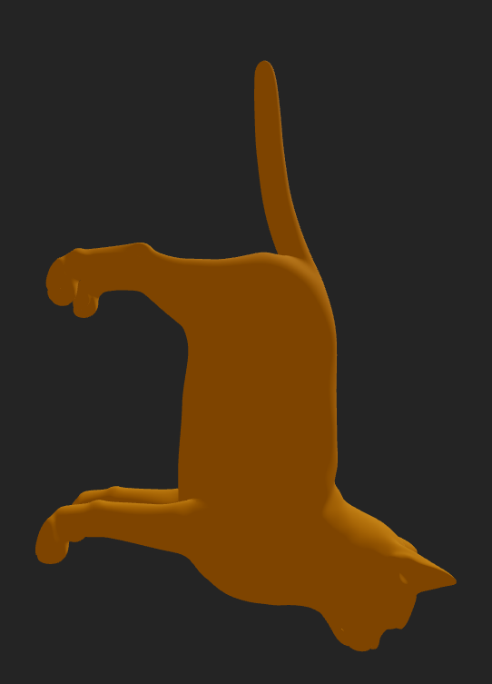
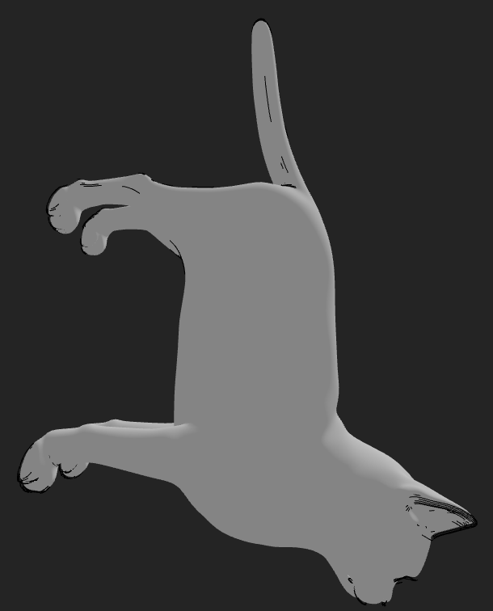
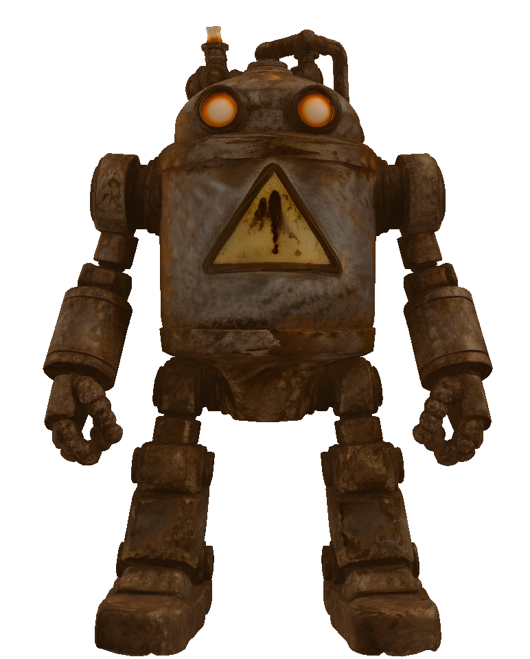

# Taller Conversion Formatos 3D

## Nombre del estudiante

Alejandro Ortiz Cortes

## Fecha de entrega

20 de febrero de 2026

---

# Descripción breve

El objetivo de este taller fue comparar, analizar y convertir modelos 3D en diferentes formatos: OBJ, STL y GLTF, utilizando Python y Three.js con React Three Fiber.

Se buscó comprender cómo cada formato almacena la geometría, incluyendo vértices, caras, normales y aristas, así como observar las diferencias en visualización, materiales y compatibilidad entre entornos.

Para ello, se desarrollaron herramientas en Python para el análisis y conversión de modelos, y una aplicación en Three.js para su visualización interactiva.

---

# Implementaciones

---

## Implementación en Python

Se desarrolló un script en Python utilizando las librerías:

* trimesh
* numpy
* os

El script permite:

### 1. Cargar modelos en múltiples formatos

Se cargaron modelos en formatos:

* OBJ
* STL
* GLB / GLTF

utilizando:

```python
mesh = trimesh.load(path, force='mesh')
```

---

### 2. Analizar propiedades geométricas

Se calcularon las siguientes propiedades:

* Número de vértices
* Número de caras
* Número de aristas únicas
* Número de normales
* Número de vértices duplicados

Código utilizado:

```python
vertices = len(mesh.vertices)
faces = len(mesh.faces)
edges = len(mesh.edges_unique)
normals = len(mesh.vertex_normals)

unique_vertices = len(np.unique(mesh.vertices, axis=0))
duplicates = vertices - unique_vertices
```

Esto permitió comparar la estructura interna de cada formato.

---

### 3. Visualizar modelos

Los modelos fueron visualizados utilizando:

```python
mesh.show()
```

Esto permitió observar la geometría directamente.

---

### 4. Conversión entre formatos

Se realizaron conversiones automáticas utilizando trimesh.exchange mediante:

```python
mesh.export(base_path + ".obj")
mesh.export(base_path + ".stl")
mesh.export(base_path + ".glb")
```

Se generaron conversiones desde cada formato original hacia los demás formatos.

Esto permitió analizar la compatibilidad entre formatos.

---

### 5. Automatización del proceso (Bonus)

Se creó un sistema automatizado que:

* Carga múltiples modelos
* Analiza sus propiedades
* Convierte los formatos
* Visualiza cada modelo
* Genera un resumen

Esto cumple el requisito de automatización.

---

## Implementación en Three.js con React Three Fiber

Se desarrolló una aplicación web interactiva utilizando:

* Three.js
* React Three Fiber
* Drei
* Leva

La aplicación permite visualizar modelos 3D y analizar sus propiedades.

---

### 1. Carga de modelos en múltiples formatos

Se cargaron modelos en:

* OBJ
* STL
* GLTF / GLB

utilizando:

```javascript
const gltf = useGLTF("/models/model.glb");
const obj = useLoader(OBJLoader, "/models/model.obj");
const stl = useLoader(STLLoader, "/models/model.stl");
```

---

### 2. Selector de formato

Se implementó una interfaz para alternar entre formatos:

```javascript
format: {
  value: "gltf",
  options: {
    GLTF: "gltf",
    OBJ: "obj",
    STL: "stl"
  }
}
```

Esto permite comparar visualmente los modelos.

---

### 3. Modos de visualización

Se implementaron múltiples modos:

* Caras
* Wireframe
* Aristas
* Vértices

Ejemplo:

```javascript
<meshStandardMaterial wireframe />
```

Esto permite analizar la estructura geométrica.

---

### 4. Visualización interactiva

Se agregaron controles de cámara:

```javascript
<OrbitControls />
```

Esto permite explorar el modelo libremente.

---

### 5. Cálculo de estadísticas del modelo (Bonus)

Se calcularon:

* Número de vértices
* Número de aristas
* Número de caras

Ejemplo:

```javascript
const stats = {
  vertices: vertexCount,
  edges: edgeSet.size,
  faces: faceCount
};
```

Estos datos se muestran en pantalla mediante Leva.

---

### 6. Renderizado en tiempo real

Se utilizó Three.js para renderizar los modelos:

```javascript
<mesh geometry={geometry}>
  <meshStandardMaterial color="orange" />
</mesh>
```

---

# Resultados visuales

## Three.js

Vista de caras:



Vista de aristas:



Vista de vértices:


---

## Python

Visualización modelo:



Archivos convertidos:


---

# Código relevante

Script Python principal:

```
python/main.py
```

Aplicación Three.js:

```
threejs/src/ModelViewer.jsx
```

---

# Prompts utilizados

Se utilizaron prompts para:

* Comprender diferencias entre formatos 3D
* Corregir conteo de vértices y aristas
* Implementar conversiones con trimesh
* Implementar visualización en Three.js

Ejemplo de prompt:

```
How to correctly count vertices, edges and faces in OBJ, STL and GLTF using Three.js and trimesh?
```

---

# Aprendizajes

Durante el desarrollo del taller se aprendió:

* Diferencias estructurales entre OBJ, STL y GLTF
* Cómo cargar y visualizar modelos 3D en Python
* Cómo convertir entre formatos utilizando trimesh
* Cómo visualizar modelos en Three.js
* Cómo calcular propiedades geométricas
* Cómo implementar visualización interactiva

También se comprendió que:

* OBJ puede contener vértices duplicados
* STL no contiene información de materiales
* GLTF es más eficiente y moderno

---

# Dificultades

Las principales dificultades fueron:

* Diferencias en el conteo de vértices entre formatos
* Manejo de geometrías indexadas y no indexadas
* Compatibilidad entre formatos
* Configuración de visualización en Python
* Interpretación correcta de datos geométricos

Estas dificultades se resolvieron mediante normalización de geometría y análisis correcto de vértices únicos.

---

# Conclusión

El taller permitió comprender cómo funcionan los formatos 3D y cómo se interpretan en distintos entornos.

Se logró implementar correctamente:

* Carga de modelos
* Análisis de geometría
* Conversión entre formatos
* Visualización en Python
* Visualización interactiva en Three.js

Esto permitió comparar OBJ, STL y GLTF y entender sus diferencias estructurales y de visualización.

---

# Créditos de modelos 3D

Los modelos utilizados en este taller fueron obtenidos de las siguientes fuentes públicas:

## Modelo OBJ – Cat

Fuente: Free3D  
https://free3d.com/es/modelo-3d/cat-v1--522281.html?dd_referrer=

Licencia: Uso gratuito para fines educativos y personales.

---

## Modelo STL – Ultimate Ice Scraper

Fuente: Printables  
https://www.printables.com/model/658027-ultimate-ice-scraper/files

Autor: Publicado en Printables  
Licencia: Uso permitido según condiciones de la plataforma.

---

## Modelo GLB – Robot oxidado

Fuente: Pixabay  
https://pixabay.com/es/3d-models/glb-robot-robot-oxidado-3393/

Licencia: Libre de derechos bajo la licencia de contenido de Pixabay.

---

Estos modelos fueron utilizados únicamente con fines educativos para el análisis y visualización de estructuras de mallas 3D.
