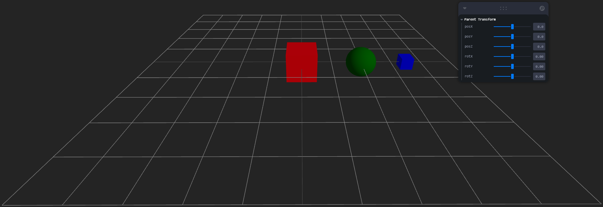
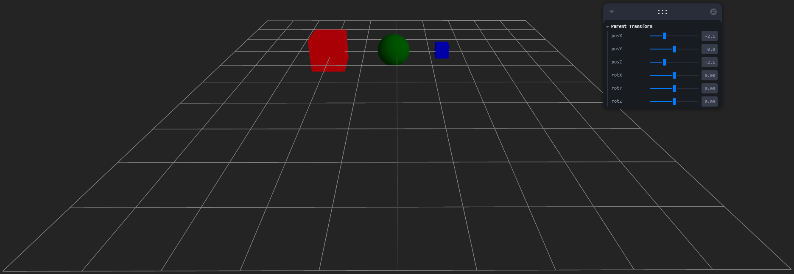
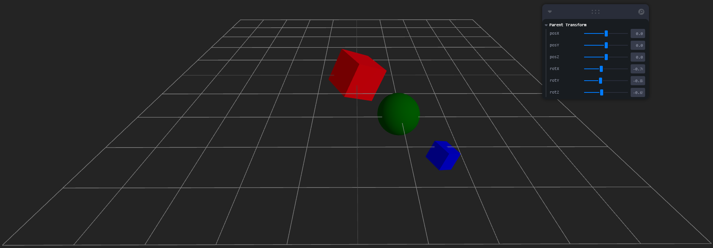

# Taller Jerarquias Transformaciones

## Nombre del estudiante

Alejandro Ortiz Cortes

## Fecha de entrega

21 de febrero de 2026

---

# Descripción breve

El objetivo de este taller es comprender el uso de estructuras jerárquicas y árboles de transformación en escenas 3D utilizando React Three Fiber. Se desarrolló una escena donde se implementa una jerarquía padre → hijo → nieto usando nodos `<group>` y objetos `<mesh>`.

Se aplicaron transformaciones de traslación y rotación al nodo padre mediante controles en tiempo real utilizando la librería Leva, permitiendo observar cómo los nodos hijos heredan automáticamente dichas transformaciones. Esto permite simular movimiento relativo y entender el comportamiento de las transformaciones encadenadas en gráficos 3D.

---

# Implementaciones

## Three.js con React Three Fiber

Se creó un proyecto usando Vite y React Three Fiber, en el cual se implementó una estructura jerárquica de tres niveles:

* Nodo padre: un cubo rojo
* Nodo hijo: una esfera verde
* Nodo nieto: un cubo azul

Esta jerarquía se construyó usando `<group>` para establecer relaciones padre-hijo.

Las transformaciones aplicadas al nodo padre incluyen:

* Traslación en los ejes X, Y y Z
* Rotación en los ejes X, Y y Z

Estas transformaciones se controlan en tiempo real usando sliders proporcionados por la librería Leva.

Cuando el nodo padre se mueve o rota, los nodos hijo y nieto se transforman automáticamente debido a la herencia jerárquica.

Esto demuestra el funcionamiento de los árboles de transformación en gráficos 3D.

---

# Resultados visuales

Las siguientes capturas o animaciones muestran el funcionamiento de la jerarquía y las transformaciones:

**Three.js React Three Fiber**

Vista de estructura padre, hijo y nieto:



Vista de traslación:



Vista de rotación:



---

# Código relevante

El siguiente fragmento muestra la estructura jerárquica implementada:

```jsx
<group position={[posX, posY, posZ]} rotation={[rotX, rotY, rotZ]}>

  {/* Padre */}
  <mesh>
    <boxGeometry args={[1, 1, 1]} />
    <meshStandardMaterial color="red" />
  </mesh>

  {/* Hijo */}
  <group position={[2, 0, 0]}>
    <mesh>
      <sphereGeometry args={[0.5, 32, 32]} />
      <meshStandardMaterial color="green" />
    </mesh>

    {/* Nieto */}
    <group position={[1.5, 0, 0]}>
      <mesh>
        <boxGeometry args={[0.4, 0.4, 0.4]} />
        <meshStandardMaterial color="blue" />
      </mesh>
    </group>

  </group>

</group>
```

Este código demuestra cómo los nodos hijos heredan las transformaciones del nodo padre.

---

# Prompts utilizados

Se utilizaron herramientas de IA para:

* Generar la estructura jerárquica usando React Three Fiber
* Implementar controles interactivos con Leva
* Comprender la herencia de transformaciones en estructuras jerárquicas
* Generar la documentación del README

Ejemplo de prompt utilizado:

> "Crear una estructura jerárquica padre hijo nieto usando React Three Fiber y controlar las transformaciones con Leva."

---

# Aprendizajes y dificultades

## Aprendizajes

Durante el desarrollo de este taller se comprendieron los siguientes conceptos:

* Uso de estructuras jerárquicas en gráficos 3D
* Funcionamiento de nodos `<group>` en React Three Fiber
* Herencia de transformaciones entre nodos padre e hijo
* Uso de Leva para crear controles interactivos en tiempo real
* Aplicación de transformaciones como traslación y rotación

Se observó que cuando el nodo padre se mueve, todos sus hijos se mueven con él, lo cual es fundamental en animaciones y modelado jerárquico.

## Dificultades

Las principales dificultades fueron:

* Comprender cómo funcionan las transformaciones jerárquicas
* Entender el sistema de coordenadas local vs global
* Configurar correctamente React Three Fiber y sus dependencias
* Implementar correctamente la jerarquía usando `<group>`

Estas dificultades fueron superadas mediante pruebas, documentación y experimentación.

---

# Conclusión

Este taller permitió comprender el funcionamiento de las jerarquías y transformaciones en gráficos 3D. Se logró implementar una estructura de tres niveles donde las transformaciones del nodo padre afectan correctamente a los nodos hijos y nietos.

Esto demuestra la importancia de las estructuras jerárquicas en el desarrollo de aplicaciones 3D, animaciones, videojuegos y simulaciones.

React Three Fiber proporciona una forma clara y eficiente de implementar estos conceptos en aplicaciones web.
