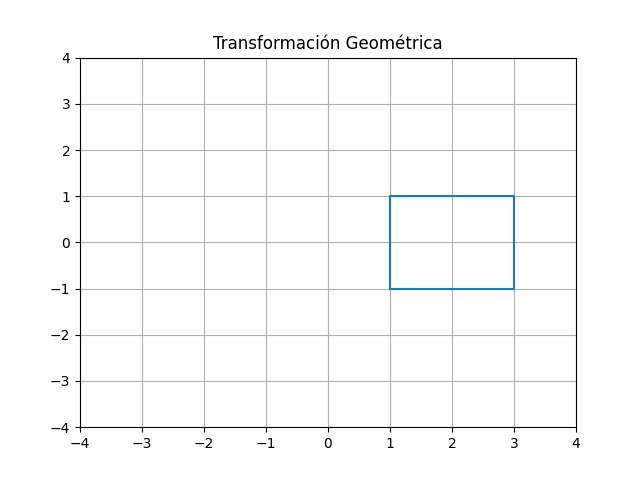
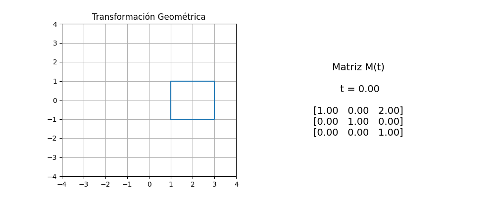
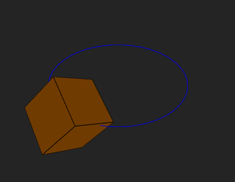
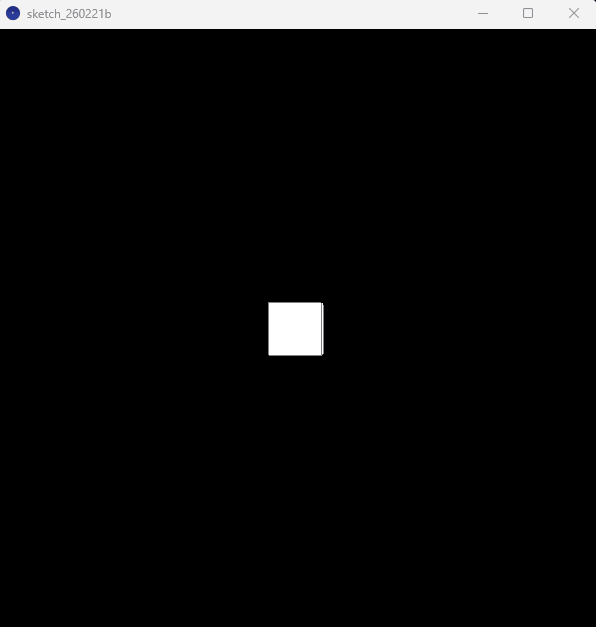
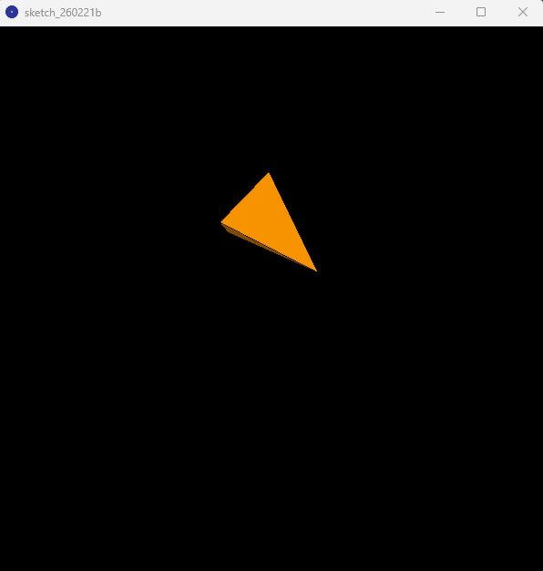

# Taller Transformaciones

## Nombre del estudiante

Alejandro Ortiz Cortes

## Fecha de entrega

21 de febrero de 2026

---

# Descripción breve

El objetivo de este taller fue explorar los conceptos fundamentales de **transformaciones geométricas** dentro de distintos entornos de programación visual.

Se desarrolló un *Hola Mundo Visual* aplicando:

* Traslación
* Rotación
* Escalado

Estas transformaciones fueron implementadas tanto de forma **estática** como **animada en función del tiempo**, permitiendo observar cómo cambian los objetos gráficos mediante matrices de transformación y funciones temporales.

---

# Implementaciones

## Python — Matplotlib + Numpy + ImageIO

Se desarrolló una animación 2D utilizando matrices homogéneas para aplicar transformaciones geométricas a un cuadrado.

**Características implementadas:**

* Definición de figura base mediante puntos.
* Uso de matrices de:

  * Traslación
  * Rotación
  * Escala

* Composición de transformaciones mediante multiplicación matricial.
* Animación dependiente del tiempo `t`.
* Visualización simultánea:

  * Figura transformada
  * Matriz resultante M(t)

* Exportación automática como GIF animado.

**Conceptos aplicados**

* Álgebra lineal
* Coordenadas homogéneas
* Transformaciones compuestas

---

## React Three Fiber — Three.js

Se creó una escena 3D interactiva utilizando React Three Fiber.

**Implementación realizada:**

* Cubo 3D con iluminación.
* Trayectoria circular visualizada mediante líneas.
* Animaciones controladas con `useFrame`.

**Transformaciones aplicadas:**

* Traslación circular:

```js
position.x = cos(t)
position.z = sin(t)
```

* Rotación continua sobre ejes X y Y.
* Escala oscilante:

```js
scale = 1 + 0.3 * sin(t)
```

**Extras implementados**

* `OrbitControls` para navegación libre.
* Visualización de bordes del cubo.
* Movimiento dependiente del tiempo real.

---

## Processing (3D)

Se desarrolló un sketch 3D en Processing aplicando transformaciones gráficas básicas.

**Características:**

* Renderizado en modo `P3D`.
* Dibujo de un cubo central.
* Transformaciones aplicadas:

| Transformación | Implementación                        |
| -------------- | ------------------------------------- |
| Traslación     | Centrado en pantalla                  |
| Rotación       | `rotateY(frameCount * 0.02)`          |
| Escala         | `scale(1 + 0.5*sin(frameCount*0.05))` |

La animación depende directamente del tiempo usando `frameCount`.

---

## Resultados visuales

### Python

Figura 2D:



Matriz resultante:


Figura 2D y matriz resultante:



### React Three Fiber




### Processing

Cubo:



Piramide:



---

# Código relevante

## Transformación compuesta (Python)

```python
M = T @ R @ S
transformed = apply_transform(square, M)
```

## Animación en React Three Fiber

```jsx
useFrame((state) => {
  const t = state.clock.elapsedTime
  meshRef.current.position.x = Math.cos(t) * radius
  meshRef.current.position.z = Math.sin(t) * radius
})
```

## Animación en Processing

```java
void setup() {
  size(600, 600, P3D);
}

void draw() {
  background(0);

  translate(width/2, height/2);

  rotateY(frameCount * 0.02);

  float s = 1 + 0.5*sin(frameCount * 0.05);
  scale(s);

  box(100);
}
```

---

# Prompts utilizados

Durante el desarrollo se utilizaron herramientas de IA generativa para:

* Explicar conceptos de transformaciones geométricas.
* Optimizar animaciones en React Three Fiber.
* Generar estructuras base de README.
* Revisar implementación de matrices homogéneas en Python.

Los prompts estuvieron orientados a:

* *"animar transformaciones geométricas en Python usando matrices"*
* *"useFrame animation React Three Fiber example"*
* *"Processing transformaciones translate rotate scale ejemplo"*

---

# Aprendizajes y dificultades

## Aprendizajes

* Comprensión práctica de las transformaciones geométricas.
* Uso del tiempo como variable de animación.
* Diferencias entre motores gráficos 2D y 3D.
* Relación entre álgebra lineal y gráficos computacionales.
* Integración de múltiples entornos visuales.

## Dificultades

* Sincronizar transformaciones entre distintos frameworks.
* Manejo correcto del orden de multiplicación de matrices.
* Ajuste de escalas y velocidades de animación.
* Comprender diferencias entre transformaciones locales y globales.

---

El taller permitió consolidar la relación entre matemáticas, programación visual y animación gráfica en distintos entornos tecnológicos.
